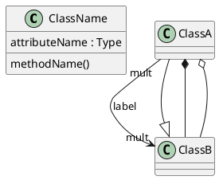

# UML Evaluation Framework

A hybrid evaluation framework for assessing LLM-generated UML class diagrams extracted from natural language requirements.

## Overview

This framework implements the evaluation methodology described in the thesis "Automated Evaluation Framework for LLM-Generated UML Class Diagrams". It provides:

1. **Reference-Based Evaluation**: Compares generated diagrams against ground truth using:
   - Triple decomposition of UML elements
   - Semantic matching via SBERT embeddings
   - Precision, recall, and F1 metrics

2. **LLM-as-Judge Evaluation**: Assesses diagrams directly against requirements using:
   - Structured evaluation across three dimensions (completeness, correctness, hallucination)
   - Ensemble approach with multiple runs for robustness

## Setup

### Prerequisites

- Python 3.10 or higher
- CUDA-capable GPU (recommended for SBERT, but CPU works)
- OpenRouter API key (for LLM access)

### Installation

1. **Clone or copy the project:**
   ```bash
   cd /path/to/uml-eval
   ```

2. **Create a virtual environment:**
   ```bash
   python -m venv venv
   source venv/bin/activate  # Linux/Mac
   # or: venv\Scripts\activate  # Windows
   ```

3. **Install dependencies:**
   ```bash
   pip install -r requirements.txt
   ```

4. **Configure API access:**
see example.env. Copy and save as .env

### Getting an OpenRouter API Key

1. Go to [openrouter.ai](https://openrouter.ai/)
2. Create an account and navigate to Keys
3. Generate an API key
4. Add credits (the full experiment costs approximately $12 with our settings)

## Project Structure

```
uml-eval/
├── main.py              # CLI entry point
├── requirements.txt     # Python dependencies
├── .env                 # API keys (create from .env.example)
├── src/
│   ├── __init__.py
│   ├── config.py        # Configuration management
│   ├── parser.py        # PlantUML parsing
│   ├── extractor.py     # Triple extraction
│   ├── matcher.py       # Semantic matching (SBERT)
│   ├── judge.py         # LLM-as-Judge evaluation
│   └── pipeline.py      # Experiment orchestration
├── data/
│   ├── requirements/    # Natural language requirement files (.txt)
│   └── references/      # Reference PlantUML diagrams (.puml)
└── results/             # Experiment outputs (.json)
```

## Usage

### Running the Full Experiment

```bash
# Run with default settings (all requirements, all strategies, all models)
python main.py run

# Run specific requirements with specific strategies
python main.py run -r REQ-09 REQ-10 -s zero-shot few-shot

# Dry run to see what would be executed
python main.py run --dry-run

# Skip the LLM-as-Judge (faster, cheaper)
python main.py run --skip-judge
```

### Evaluating a Single Diagram

```bash
# Reference-based evaluation only
python main.py evaluate \
    --diagram generated.puml \
    --reference data/references/REQ-09.puml \
    --verbose

# Include LLM-as-Judge
python main.py evaluate \
    --diagram generated.puml \
    --reference data/references/REQ-09.puml \
    --requirements data/requirements/REQ-09.txt \
    --judge
```

### Sensitivity Analysis

```bash
# Test different similarity thresholds
python main.py sensitivity \
    --diagram generated.puml \
    --reference reference.puml
```

## Adding Your Own Data

### Requirements Format

Create text files in `data/requirements/` with the requirement ID as filename:

```
data/requirements/REQ-XX.txt
```

### Reference Diagrams Format

Create PlantUML files in `data/references/`:



**Constraints:**
- No visibility modifiers (+/-/#)
- No packages or notes
- No interfaces or stereotypes
- Methods without parameters

## Understanding the Output

### Reference-Based Metrics

- **Precision**: Proportion of generated elements that match reference
  - Low precision suggests hallucination
- **Recall**: Proportion of reference elements that were generated
  - Low recall suggests incompleteness
- **F1**: Harmonic mean of precision and recall

### LLM-as-Judge Scores (1-5 scale)

- **Completeness**: Are all required elements present?
- **Correctness**: Are elements accurately modeled?
- **Hallucination**: Are there fabricated elements? (5 = no hallucination)

## Configuration

Edit `src/config.py` to adjust:

```python
# Semantic matching threshold
semantic_threshold: float = 0.80

# SBERT model for embeddings
sbert_model: str = "all-MiniLM-L6-v2"

# Number of samples per configuration
samples_per_config: int = 5

# Number of judge runs per diagram
judge_runs_per_diagram: int = 5
```

## License

This project is part of my master's thesis at Universität Hildesheim.
